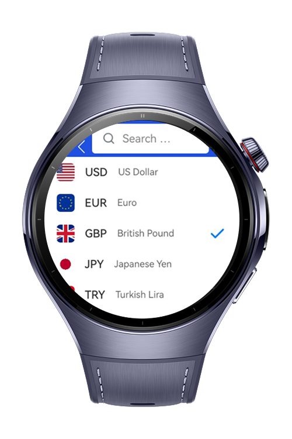
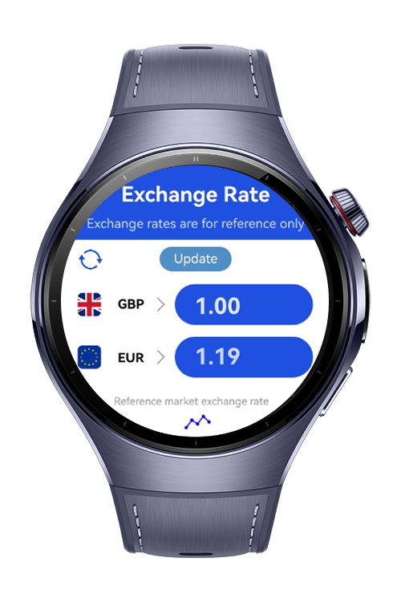
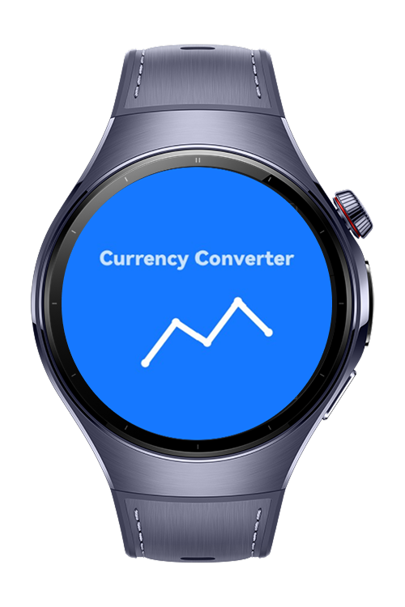

> **Note:** To access all shared projects, get information about environment setup, and view other guides, please visit [Explore-In-HMOS-Wearable Index](https://github.com/Explore-In-HMOS-Wearable/hmos-index).

# Currency Converter – Wearable App

CurrencyConverter is a fully functional wearable watch application including currency convert functionality built for **HarmonyOS NEXT wearable devices**,
developed using **ArkTS**. 

# Preview
<div>
  
  
  
</div>

This demo showcases a simple yet effective smartwatch app that allows users to convert currencies instantly with a minimal and intuitive interface. The app consists of two main screens:
The application enables users to:

- Converter Page: On this screen, users can select a base currency and convert it to another with real-time results. It provides instant conversion feedback with a user-friendly layout optimized for watch screens.
- Exchange Rate Page: This screen displays a list of the most recent exchange rates fetched from an online service. Users can browse through the currencies and monitor current trends at a glance.
- Splash Page
- Selecting currency types from selection page
- Converting a currency to another one with specified value
- 14 Currency Support
- Search Currency functionality with searchbar at selection page

# Use Cases

Currency Converter Clock App is designed to make daily currency checking and conversion more seamless and accessible, especially on-the-go. The following are the application's featured use cases:
1. Real-Time Currency Conversion: Users can quickly convert between major currencies such as USD, EUR, GBP, TRY, and more while traveling, shopping, or budgeting.
2. Instant Access via Watch Interface: With its intuitive and minimal interface, users can perform conversions directly from the smartwatch without needing to pull out a phone.
3. Always Up-to-Date Rates: The app fetches the latest exchange rates via internet connection and presents them in a clean format optimized for quick readability.
4. One-Tap Currency Selection: Users can easily switch base and target currencies with a single tap, making the app practical for frequently changing currency pairs.
5. Lightweight and Battery-Friendly: Optimized for smartwatches, the app runs smoothly with minimal resource usage, ensuring long-lasting performance throughout the day.

# Technology
**Stack**

- **DevEco Studio Version**: 5.1.0.240SP1 or higher
- **HarmonyOS SDK**: NEXT Developer Preview
- **Target Devices**: Huawei Watch 5 / HarmonyOS NEXT compatible watches
- **Limitations**: Keyboard is not working on previewer
- **@kit.ArkGraphics2D** :
  - common2D : Used to define RGBA color values for custom color creation.
  - drawing : Used to create a ColorFilter with blending modes to apply visual effects on images/icons.

# Preparations Before Run
You must manually sign the application before running it.

# Directory Structure

```
entry/src/main/ets/
│
├── viewmodel/
│ ├── CurrencyData.ets // CurrencyData model
│ │── CurrencyViewModel.ets // Currency Data Source and Calculations
│
├── pages/
│ ├── ExchangePage.ets // Main Page of application
│ │── NavigationRouter.ets // Navigation Container
│ │── SelectCurrencyPage.ets // Currency List Page for selecting
│ └── SplashPage.ets // Welcome Page of application
│
├── view/
│ ├── BaseCurrencyRow.ets // Currency component requested to be converted
│ │── CurrencyItem.ets // Core Component of BaseCurrencyRow and TargetCurrencyRow
│ │── SearchBar.ets // SearchBar component
│ └── TargetCurrencyRow.ets // Currency component requested to be viewed as output
│
├─ resources/
│ └── media/ // Flag sprites & meta icons
│
└── module.json5 // Metadata and device compatibility
```

# Operation Guide

1. Clone the repository into DevEco Studio.
2. Make sure you are using **DevEco Studio 5.1.0+** with **OpenHarmony SDK**.
3. Connect a Huawei smartwatch (Watch 5 or equivalent).
4. Build and deploy to the wearable device.

# Constraints and Restrictions

**Known Issues:**

- Keyboard is not working on previewer

**Planned Features:**

- Wearable keyboard implementation
- Exchange of currency types
- Vibration feedbacks
- More currency supports
- Monthly / Weekly graphics between all currencies
